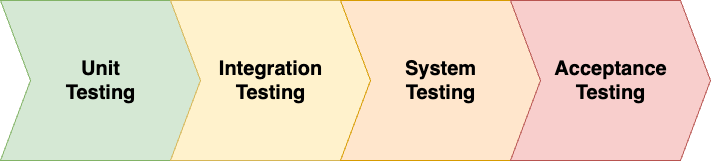

## Hack day - JUnit5 - Tam Pham

## Table of contents:
<ul style="list-style: circle;">
    <li><a href="#title_1" target="_blank">1. Overview about UnitTest</a></li>
    <li><a href="#title_2" target="_blank">2. Difference between JUnit5 and JUnit4</a></li>
    <li><a href="#title_3" target="_blank">3. UTD, UTS, PICT, CSV source, Stream Source, SQL source</a></li>
    <li><a href="#title_4" target="_blank">4. Mockito in JUnit5, BeforeAll, AfterAll, BeforeEach, AfterEach</a></li>
</ul>

<h2 id="title_1">1. Overview about UnitTest</h2>
### About testing flow:

 

<i><b>Note: </b> This document will focus on JUnit5 's function and other concepts about testing, coverage, etc. would be the most basic </i>

<b>Acronyms may appear in the article: </b>
<ul>
    <li>UT - Unit Testing</li>
    <li>IT - Integration Testing</li>
    <li>ST - System Testing</li>
    <li>AT - Acceptance Testing</li>
    <li>UTD - Unit Testing Design</li>
    <li>UTS - Unit Testing Spec</li>
</ul>

### What's Unit Testing?
Unit testing involves the testing of each unit or an individual component of the software application. It is the first level of functional testing. The aim behind unit testing is to validate unit components with its performance.

A unit is a single testable part of a software system and tested during the development phase of the application software.

The purpose of UT is to test the correctness of isolated code. A unit component is an individual function or code of the application. White box testing approach used for unit testing and usually done by the developers.

Whenever the application is ready and given to the Test engineer, he/she will start checking every component of the module or module of the application independently or one by one, and this process is known as Unit testing or components testing.

### Why do we need Unit Testing?
In a testing level hierarchy, UT is the first level of testing done before integration and other remaining levels of the testing.
It uses modules for the testing process which reduces the dependency of waiting for UT frameworks, stubs, drivers and mock objects are
used for assistance in UT.

Generally, the software goes under four level of testing: UT, IT, ST, and AT but sometimes
due to time consumption software engineers does minimal UT but skipping of UT may lead to higher defects during IT, ST, AT 
or even during Beta testing which takes place after the completion of software application.

Some crucial reasons are listed below:
<ul>
    <li>Unit testing helps tester and developers to understand the base of code that makes them able to change defect causing code quickly.</li>
    <li>Unit testing helps in the documentation.</li>
    <li>Unit testing fixes defects very early in the development phase that's why there is a possibility to occur a smaller number of defects in upcoming testing levels.</li>
    <li>It helps with code re-usability by migrating code and test cases.</li>
</ul>

### Types of UnitTesting
In UT, each unit of code is tested independently to ensure that is behaves as expected, without any dependency on other units. Unit tests typically focus on a small piece of 
functionality and are automated, allowing for efficient and repeatable testing. There are several types of unit testing, each with its own advantages 
and use cases. But we usually know about 3 types of UT: white-box testing, black-box testing, and gray-box testing.
<a href="https://www.javatpoint.com/types-of-unit-testing" target="_blank">Detailed for UT types</a>
### How to Unit Testing?

<h2 id="title_2">2. Difference between JUnit5 and JUnit4</h2>

<h2 id="title_3">3. UTD, UTS, PICT, CSV source, Stream Source, SQL source</h2>

<h2 id="title_4">4. Mockito in JUnit5, BeforeAll, AfterAll, BeforeEach, AfterEach</h2>
